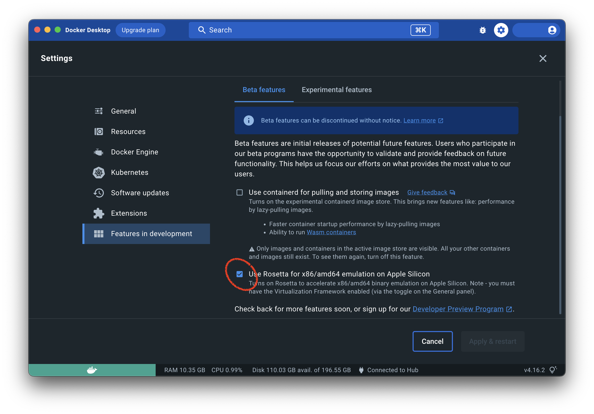

# Introduction
To showcase my preferred patterns and practices, I have created a simple appointment scheduling api that allows 
users to create, edit, and delete appointments to a calendar. Users can also create an account and a calendar.
An appointment is an object which is added to a calendar, and that calendar is associated with a user account.

## To Do
- REPR
- Validation
- Logging
- Error Handling
- CQRS
- Clean Architecture 

## Technologies
- Testcontainers
- xUnit
- EF Core for writing to the datastore
- Dapper for reading from the datastore
- FluentValidation 
- Serilog

## Patterns
- Clean Architecture
- CQRS
- REPR (Request Endpoint Response)
- Repository Pattern
- Feature Folders

## Prerequisites
- .NET 8 SDK
- The LATEST Docker for [Mac](https://docs.docker.com/desktop/install/mac-install/)/[Windows](https://docs.docker.com/desktop/install/windows-install/)

On Mac enable Rosetta in the beta features as shown in the image below:



We will build a basic online appointment api. The api will allow users to create an account
with an associated calendar. Then users can create, modify & view appointments in that
calendar. We will ignore authentication in this exercise.

- Using TDD, we will build out the functionality of the application
- The functionality is defined by the requirements in the `Requirements` section

## Running the Tests

- Run `dotnet test` from the root of the project

# Requirements
The requirements are written in the Given When Then format. This is a common format used
for acceptance criteria & tests. The requirements are written in a way that is not specific to any 
particular technology. This allows us to write the tests first and then implement the
functionality to make the tests pass.

Writing Acceptance Tests will be out of the scope of this exercise. However, the requirements
can still guide our Integration & Unit Tests.

```
Given there is no account for user A
When user A creates an account
Then the account is persisted
And a calendar is created
```

```
Given there is an account for user A
When user A deletes their account
Then the account is not active
And the calendar is not active
```

```
Given there is an account for user A
And there is a calendar for user A
When a user creates an appointment in the calendar for user A
Then the appointment can be viewed
```

```
Given there is an account for user A
And there is a calendar for user A
When a user creates an appointment in the calendar for user A
Then the appointment can be viewed
```

```
Given there is an account for user A
And there is a calendar for user A
And there is an appointment Z
When a user updates appointment Z
Then the updated appointment is persisted
```

```
Given there is an account for user A
And there is a calendar for user A
And there is an appointment Z
When a user deletes appointment Z
Then appointment Z is not active
```

```
Given there is an account for user A
And there is a calendar for user A
And there is an appointment Z at 11am
When a user creates another appointment X at 11am
Then appointment X is also persisted
```

```
Given there is an account for user A
And there is a calendar for user A
And there is an appointment Z at 11am
And there is an appointment X at 11am
When a user gets all appointments
Then all appoints can be viewed
And the conflicting appointments can also be viewed
```

